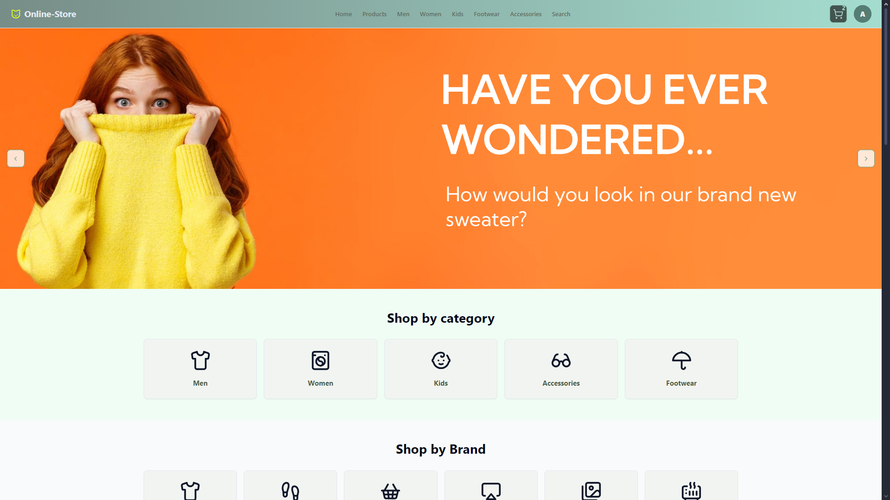
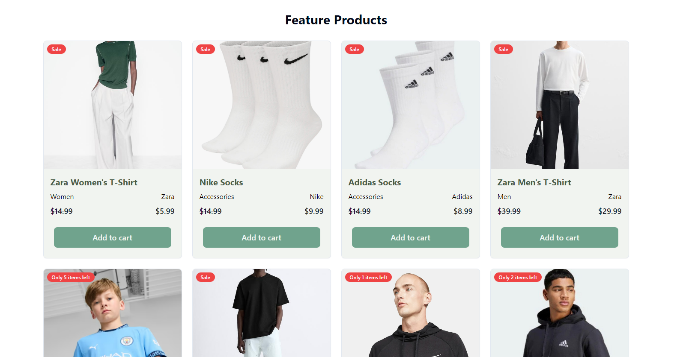
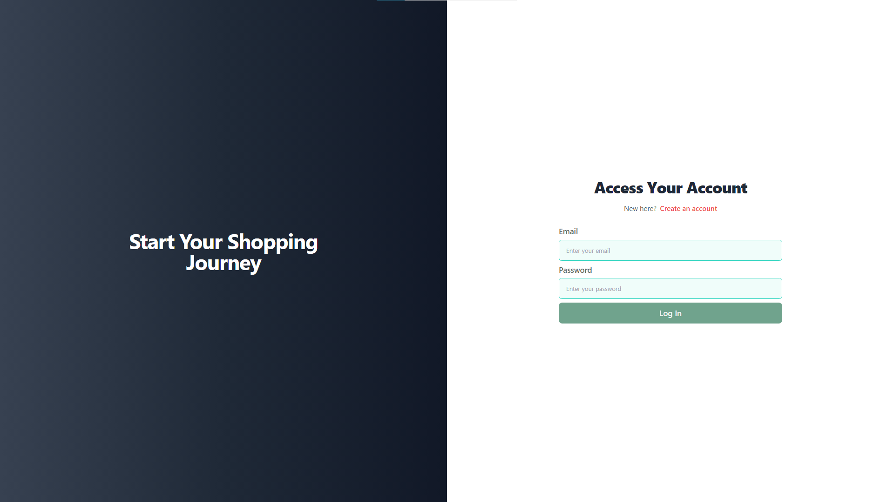

# 🛍️ ClothesShop — Online Clothing Store

**Fullstack project**: React frontend + Node.js/Express/MongoDB backend.  
I acted as the **sole backend developer** in a 5‑person team (4 frontend developers + me).

---

## 🚀 Tech Stack

- **Frontend**: React, HTML, CSS, JavaScript  
- **Backend**: Node.js, Express.js  
- **Database**: MongoDB (Mongoose)  
- **APIs**: RESTful  
- **Authentication**: JWT-based  
- **Version Control**: Git & GitHub

---

## 👨‍💻 My Role (Backend Developer)

- Designed the database using **MongoDB / Mongoose**  
- Built a REST API for **products, users, cart, and orders**  
- Implemented **JWT authentication and authorization** (user/admin roles)  
- Created modular controllers, routes, and models for scalability  
- Tested endpoints using Postman to ensure stability and accuracy

---

## 📸 Project Preview

> Add screenshots in the `/images` folder and update paths below:

| Homepage                  | Product Page             | Registration Page        |
|---------------------------|--------------------------|--------------------------|
|   |   |     |

---

## ⚙️ Features

- 🛍 Product catalog with categories and search  
- 👤 User registration, login, and profile management  
- 🛒 Cart functionality and order processing  
- ⚙ Admin panel for product management  
- 🔐 Secured backend routes and data validation  
- 📦 MongoDB + Mongoose for data storage

---

## 🗂 Project Structure

```text
/server
├── config/       # Database & JWT setup
├── controllers/  # API logic
├── middleware/   # Auth & error handling
├── models/       # Mongoose schemas
├── routes/       # API routes
└── server.js     # App entry point
